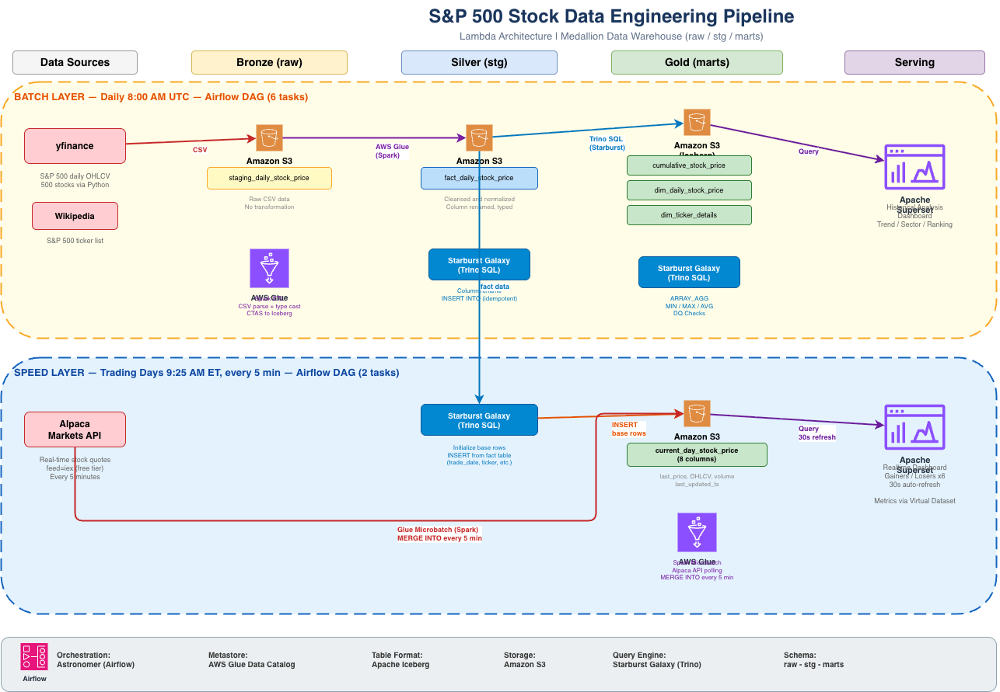

# S&P 500 Real-time Stock Price Fluctuations Tracker

A production-grade data engineering project that tracks S&P 500 stock prices through both daily batch processing and near real-time microbatch updates, built on a modern Data Lakehouse architecture.

## 1. Project Overview

### What & Why

This project builds a complete data pipeline that:
- **Ingests** daily historical stock data for all S&P 500 companies (~500 stocks)
- **Transforms** raw data through a layered data warehouse (Medallion Architecture)
- **Updates** stock prices in near real-time during trading hours (every 4 minutes)
- **Visualizes** both historical trends and live price movements via interactive dashboards

I've always been interested in the stock market and regularly follow S&P 500 trends. I wanted to apply my data engineering skills to a domain I'm genuinely curious about, while learning how to build a Lambda Architecture — handling both batch historical data and near real-time data in a single system. This project gave me hands-on experience building a complete data lakehouse pipeline from scratch, covering data ingestion, ETL, data modeling, orchestration, and visualization.

### Core Features

| Feature | Description |
|---------|-------------|
| Daily Batch Pipeline | Automated daily ingestion of S&P 500 stock data via yfinance, with full transformation through Bronze → Silver → Gold layers |
| Near Real-time Updates | Microbatch polling of Alpaca Markets API every 4 minutes during trading hours, calculating 6 price-change indicators |
| Historical Analysis Dashboard | Interactive Superset dashboard with trend lines, sector comparisons, market cap distribution, and performance rankings |
| Real-time Monitoring Dashboard | Live dashboard showing top gainers/losers across 1-day, 90-day, and 365-day windows, auto-refreshing every 30 seconds |
| Data Quality Checks | Automated null checks and row count validation after each pipeline run |

### Data Scope

- **Stocks**: S&P 500 constituents (~500 tickers)
- **Historical Range**: January 2025 – present
- **Real-time**: US market hours (9:30 AM – 4:00 PM ET), Monday – Friday
- **Update Frequency**: Batch = daily, Real-time = every 4 minutes

### Architecture Overview



---

## 2. Tech Stack

| Layer | Technology | Why This Choice |
|-------|-----------|----------------|
| Historical Data | **yfinance** | Free, reliable S&P 500 daily OHLCV data |
| Real-time Data | **Alpaca Markets API** (feed=iex) | Free tier, real-time US stock quotes |
| Storage | **Amazon S3** | Scalable, cheap object storage for data lake |
| Table Format | **Apache Iceberg** | ACID transactions (MERGE INTO), schema evolution, time travel |
| ETL Engine | **AWS Glue 4.0** (PySpark) | Serverless Spark for heavy compute — CSV loading, microbatch MERGE |
| Query Engine | **Starburst Galaxy** (Managed Trino) | Interactive SQL directly on S3/Iceberg, no data movement needed |
| Metadata | **AWS Glue Data Catalog** | Iceberg metastore, shared between Glue and Starburst |
| Orchestration | **Astronomer** (Managed Airflow) | DAG scheduling, task dependency management, monitoring |
| Visualization | **Apache Superset** | Open-source BI tool with Trino native support, auto-refresh |

**Architecture Philosophy**: Use Spark (Glue) only for what Trino can't do — CSV parsing and MERGE INTO. Everything else (column renaming, aggregations, DQ checks) runs as Trino SQL, which is faster and cheaper.

---

## 3. Data Pipeline

### 3.1 Batch Pipeline (Daily)

**Schedule**: Every day at 8:00 AM UTC
**Airflow DAG**: `load_daily_stock_price_dag` (6 tasks)

```
download_daily_data → load_staging → staging_to_fact → load_cumulative → load_dim → dq_checks
     (yfinance)       (Glue ETL)    (Trino SQL)       (Trino SQL)       (Trino SQL)  (Trino SQL)
```

| Step | Tool | What It Does |
|------|------|-------------|
| 1. Download | Python (yfinance) | Downloads previous trading day's data for all 500 stocks, uploads CSV to S3 |
| 2. Load Staging | AWS Glue (Spark) | Reads CSV from S3, casts types, writes to Iceberg table `raw.staging_daily_stock_price` |
| 3. Staging → Fact | Starburst (Trino SQL) | Renames columns (`open` → `open_price`, `snapshot_date` → `trade_date`), inserts into `stg.fact_daily_stock_price` |
| 4. Fact → Cumulative | Starburst (Trino SQL) | `ARRAY_AGG(close_price ORDER BY trade_date)` — builds price history array per ticker |
| 5. Fact → Dim | Starburst (Trino SQL) | Calculates `latest_price`, `historic_low`, `historic_high` per ticker |
| 6. DQ Checks | Starburst (Trino SQL) | Validates no nulls in key columns, checks row counts match |

### 3.2 Real-time Pipeline (Microbatch)

**Schedule**: Trading days at 9:25 AM ET (13:25 UTC), Monday – Friday
**Airflow DAG**: `update_current_day_stock_price_dag` (2 tasks)

```
init_current_day_stock_price → run_microbatch
      (Trino SQL)                (Glue Job, ~7.5 hours)
```

| Step | Tool | What It Does |
|------|------|-------------|
| 1. Initialize | Starburst (Trino SQL) | Clears `current_day_stock_price`, inserts latest trade_date rows with NULL prices (ready for microbatch to fill) |
| 2. Microbatch | AWS Glue (Spark) | Polls Alpaca API every 5 minutes, `MERGE INTO` updates last_price, OHLCV, volume, last_updated_ts. Runs continuously until market close. |

**Derived metrics (computed in Superset Virtual Datasets, not in the table):**

| Metric | Computed As |
|--------|------------|
| Price change vs last close | `last_price - prev_day_close` (JOIN with fact table) |
| Price change vs last close (%) | `(last_price - prev_day_close) / prev_day_close * 100` |
| Price change vs 90-day avg | `last_price - avg_90d` (JOIN with fact table) |
| Price change vs 365-day avg | `last_price - avg_365d` (JOIN with fact table) |

### 3.3 Why Microbatch Instead of Kafka?

We chose microbatch over a streaming architecture (Kafka + Flink) because:
1. **Data source is REST API**, not an event stream — polling is the natural pattern
2. **4-minute latency is sufficient** for dashboard monitoring use cases
3. **Cost**: One Glue Job vs. a Kafka cluster + Flink consumers
4. **Complexity**: Simple while-loop vs. stream processing framework

If sub-second latency were needed (e.g., algorithmic trading signals), we would introduce Kafka.

---

## 4. Data Modeling

### 4.1 Medallion Architecture (raw → stg → marts)

We organize data into three layers following the Medallion Architecture pattern:

```
┌─────────────────────────────────────────────────────────────┐
│  raw (Bronze)     — Land raw data as-is, no transformation  │
│  └── staging_daily_stock_price                              │
├─────────────────────────────────────────────────────────────┤
│  stg (Silver)     — Cleanse & normalize (rename, cast)      │
│  └── fact_daily_stock_price                                 │
├─────────────────────────────────────────────────────────────┤
│  marts (Gold)     — Business aggregations & serving         │
│  ├── cumulative_stock_price     (ARRAY_AGG)                 │
│  ├── dim_daily_stock_price      (aggregated metrics)        │
│  ├── dim_ticker_details         (company info)              │
│  └── current_day_stock_price    (real-time serving, 8 cols) │
└─────────────────────────────────────────────────────────────┘
```

**Why three layers?**

- **raw**: If upstream data changes format, we can re-transform from raw without re-downloading
- **stg**: A clean, standardized version of the data — column names follow conventions, types are correct
- **marts**: Business-ready tables with aggregations applied. This is what dashboards query.

### 4.2 Table Relationships

```
                    ┌─────────────────────┐
                    │ yfinance / CSV       │
                    └──────────┬──────────┘
                               │
                    ┌──────────▼──────────┐
                    │ raw.staging_daily   │  Raw CSV landing
                    │ _stock_price       │  (ticker, snapshot_date, open, high, low, close, volume)
                    └──────────┬──────────┘
                               │  Glue ETL: parse CSV, cast types
                               │
                    ┌──────────▼──────────┐
                    │ stg.fact_daily      │  Cleansed fact table
                    │ _stock_price       │  (trade_date, ticker, open_price, ..., volume)
                    └──────┬───┬───┬──────┘
                           │   │   │
              ┌────────────┘   │   └────────────┐
              │                │                │
   ┌──────────▼────┐ ┌────────▼────────┐ ┌─────▼──────────────┐
   │ marts.        │ │ marts.          │ │ marts.             │
   │ cumulative    │ │ dim_daily       │ │ current_day        │
   │ _stock_price  │ │ _stock_price    │ │ _stock_price       │
   │               │ │                 │ │ (22 columns)       │
   │ ARRAY_AGG of  │ │ latest_price    │ │                    │
   │ close prices  │ │ historic_low    │ │ Joined with:       │
   │ per ticker    │ │ historic_high   │ │ ← dim_ticker_details│
   └───────────────┘ └─────────────────┘ │ ← Alpaca API       │
                                         └────────────────────┘

   ┌───────────────────┐
   │ marts.            │  Loaded separately from yfinance
   │ dim_ticker_details│  (company_name, sector, market_cap, ...)
   └───────────────────┘
```

### 4.3 Why current_day_stock_price Only Has 8 Columns

Unlike the original design (22 columns with pre-computed metrics), we keep this table **thin** — only raw price fields:

| Source | Columns | When Populated |
|--------|---------|----------------|
| Alpaca API | ticker, last_price, open_price, high_price, low_price, volume | Every 5 min via microbatch |
| System | trade_date, last_updated_ts | Auto-set during MERGE |

**Why only 8 columns instead of 22?**

- **Metrics computed downstream**: Price change vs last close, vs 90-day avg, vs 365-day avg are calculated in **Superset Virtual Datasets** at query time, not pre-computed in the table
- **Thinner table = faster MERGE**: Updating 8 columns for 500 rows every 5 minutes is nearly free
- **Formula flexibility**: If we want to change a metric formula, we update the Virtual Dataset SQL — no need to rebuild the table or redeploy the Glue Job

### 4.4 Table Schemas

<details>
<summary><b>raw.staging_daily_stock_price</b> (7 columns)</summary>

| Column | Type | Description |
|--------|------|-------------|
| ticker | varchar | Stock symbol (e.g., AAPL) |
| snapshot_date | date | Trading date |
| open | double | Opening price |
| high | double | Highest price |
| low | double | Lowest price |
| close | double | Closing price |
| volume | bigint | Trading volume |
</details>

<details>
<summary><b>stg.fact_daily_stock_price</b> (7 columns)</summary>

| Column | Type | Description |
|--------|------|-------------|
| trade_date | date | Trading date |
| ticker | varchar | Stock symbol |
| open_price | double | Opening price |
| high_price | double | Highest price |
| low_price | double | Lowest price |
| close_price | double | Closing price |
| volume | bigint | Trading volume |
</details>

<details>
<summary><b>marts.cumulative_stock_price</b> (3 columns)</summary>

| Column | Type | Description |
|--------|------|-------------|
| ticker | varchar | Stock symbol |
| price_history | array(double) | Array of historical close prices, ordered by date |
| last_updated | date | Most recent trade date in the array |
</details>

<details>
<summary><b>marts.dim_daily_stock_price</b> (6 columns)</summary>

| Column | Type | Description |
|--------|------|-------------|
| ticker | varchar | Stock symbol |
| price_history | array(double) | Historical close prices array |
| latest_price | double | Most recent close price |
| historic_low | double | All-time low close price |
| historic_high | double | All-time high close price |
| last_updated | date | Most recent trade date |
</details>

<details>
<summary><b>marts.dim_ticker_details</b> (8 columns)</summary>

| Column | Type | Description |
|--------|------|-------------|
| ticker | varchar | Stock symbol |
| company_name | varchar | Company name (e.g., Apple Inc.) |
| sector | varchar | Industry sector (e.g., Technology) |
| industry | varchar | Sub-industry |
| market_cap | double | Market capitalization (USD) |
| market_cap_description | varchar | Category: Mega/Large/Mid/Small/Micro Cap |
| exchange | varchar | Stock exchange |
| country | varchar | Country |
</details>

<details>
<summary><b>marts.current_day_stock_price</b> (8 columns)</summary>

| Column | Type | Description |
|--------|------|-------------|
| ticker | varchar | Stock symbol (e.g., AAPL) |
| trade_date | date | Trading date |
| last_price | double | Latest price from Alpaca API |
| open_price | double | Opening price |
| high_price | double | Highest price |
| low_price | double | Lowest price |
| volume | bigint | Trading volume |
| last_updated_ts | timestamp(6) | Last microbatch update time |

> **Design choice — two approaches considered:**
>
> | | Option A: Pre-compute in table (22 cols) | Option B: Compute in Superset (8 cols) ✅ |
> |---|---|---|
> | Where metrics are calculated | Glue Job calculates 6 indicators before MERGE | Superset Virtual Dataset calculates via SQL at query time |
> | Change a formula | Modify Glue script → redeploy → re-run Job | Edit SQL in Superset → instant |
> | MERGE performance | 22 columns per row, heavier writes | 8 columns per row, ~3x faster |
> | Query performance | Direct SELECT, no JOINs | Requires JOIN with fact table |
> | Dashboard complexity | Simple — just pick columns | Need Virtual Dataset with SQL |
>
> **I chose Option B** because during development we frequently adjusted metric formulas (e.g., changing from 90-day to 60-day window, adding new indicators). With Option A, every formula change required modifying the Glue Job, redeploying, and re-running — a 10+ minute cycle. With Option B, we edit one SQL query in Superset and see results immediately. The trade-off is a slightly more complex dashboard setup, but for a 500-row table the JOIN overhead is negligible.
</details>

---

## 5. Dashboards

### 5.1 Historical Analysis Dashboard

> Data source: `stg.fact_daily_stock_price` + `marts.dim_ticker_details`

| Chart | Type | What It Shows |
|-------|------|---------------|
| S&P 500 Overall Trend | Line Chart | Average close price across all stocks over time — shows market direction |
| Sector Performance Comparison | Bar Chart | Which sectors gained/lost the most over the entire period |
| Top 20 Stocks by Volume | Table | Most actively traded stocks — indicates market interest |
| Market Cap Distribution | Pie Chart | Breakdown of Mega/Large/Mid/Small/Micro cap stocks in S&P 500 |
| Stock Performance Ranking | Table | Individual stock returns ranked best to worst, color-coded |

**Filters**: Sector

### 5.2 Real-time Fluctuations Dashboard

> Data source: `marts.current_day_stock_price` (requires microbatch running)

| Chart | Metric | Sort |
|-------|--------|------|
| Stocks Above Last Close Price (Pct) | m_price_change_last_day_pct | Top 50 gainers |
| Stocks Below Last Close Price (Pct) | m_price_change_last_day_pct | Top 50 losers |
| Stocks Above Avg Price Last 90 Days (Pct) | m_price_change_last_90_days_pct | Top 50 above 90d avg |
| Stocks Below Avg Price Last 90 Days (Pct) | m_price_change_last_90_days_pct | Top 50 below 90d avg |
| Stocks Above Avg Price Last 365 Days (Pct) | m_price_change_last_365_days_pct | Top 50 above 365d avg |
| Stocks Below Avg Price Last 365 Days (Pct) | m_price_change_last_365_days_pct | Top 50 below 365d avg |

**Filters**: Market Cap, Sector
**Auto-refresh**: Every 30 seconds

---

## 6. Key Design Decisions

### Why Iceberg over plain Parquet?

Iceberg provides **ACID transactions** — our microbatch pipeline uses `MERGE INTO` to update 500 rows every 4 minutes. With plain Parquet files, concurrent reads and writes would cause data corruption. Iceberg also supports schema evolution (we added columns via `ALTER TABLE`) and time travel for debugging.

### Why Trino (Starburst) + Spark (Glue) instead of all Spark?

**Separation of concerns**. Spark is a general-purpose compute engine with a 2-3 minute cold start. Trino is an interactive query engine that returns results in seconds. Our rule: if it can be done in SQL, use Trino. Only use Spark for what Trino can't do (reading CSVs, MERGE INTO via PySpark).

This saves both time and money — Glue charges by the minute.

### Why not Snowflake?

Snowflake is excellent for production, but this is a capstone project designed to **demonstrate technical depth**. With S3 + Iceberg + Trino, we can discuss storage format selection, compute-storage separation, ETL engine trade-offs, and data lake architecture. Snowflake abstracts all of this away.

### Why Medallion Architecture (raw/stg/marts)?

Three layers provide clear data lineage and recovery:
- **raw**: If we need to reprocess, we replay from raw without re-downloading
- **stg**: A clean checkpoint — if business logic changes, we re-transform from stg
- **marts**: Business-ready tables, optimized for dashboard queries

### Why Astronomer instead of self-hosted Airflow?

Managed Airflow eliminates the operational overhead of running a scheduler, webserver, and metadata database. For a capstone project with limited time, this lets us focus on pipeline logic rather than infrastructure.

---

## 7. Getting Started

### Prerequisites

- AWS Account (Free Tier)
- [Starburst Galaxy](https://www.starburst.io/platform/starburst-galaxy/) account (Free Tier)
- [Astronomer](https://cloud.astronomer.io) account (Trial)
- Python 3.8+
- Docker Desktop
- [Alpaca Markets](https://alpaca.markets/) API key (free)

### Quick Start

```bash
# 1. Clone the repo
git clone https://github.com/your-username/sp500-stock-tracker.git
cd sp500-stock-tracker

# 2. Download S&P 500 data
pip install yfinance pandas requests
python jobs/local/download_sp500_history.py
python jobs/local/download_sp500_ticker_details.py

# 3. Upload CSVs to S3
# Upload data/sp500_history.csv → s3://your-bucket/raw/sp500_history/
# Upload data/sp500_ticker_details.csv → s3://your-bucket/raw/sp500_ticker_details/

# 4. Run Glue Jobs (AWS Console)
# Create and run load_staging_daily_stock_price
# Create and run load_dim_ticker_details

# 5. Run SQL transformations (Starburst Query Editor)
# staging → fact → cumulative → dim → current_day (see docs)

# 6. Start Superset
docker pull apache/superset:latest
docker run -d -p 8088:8088 --name superset \
  -e SUPERSET_SECRET_KEY="$(openssl rand -base64 42)" apache/superset
# Open http://localhost:8088 (admin/admin)
```

For detailed step-by-step instructions, see [SP500_完整项目文档.md](stock-project/SP500_完整项目文档.md).

---

## 8. Project Structure

```
.
├── dags/etl/
│   ├── load_daily_stock_price_dag.py             # Batch DAG (6 tasks)
│   └── update_current_day_stock_price_dag.py      # Real-time DAG (2 tasks)
│
├── jobs/
│   ├── local/
│   │   ├── download_sp500_history.py              # Download historical prices
│   │   └── download_sp500_ticker_details.py       # Download company info
│   └── batch/
│       ├── load_staging_daily_stock_price.py       # Glue: CSV → staging
│       ├── load_dim_ticker_details.py              # Glue: CSV → dim_ticker
│       └── update_current_day_stock_price_microbatch.py  # Glue: Alpaca → MERGE
│
├── stock-project/
│   ├── dags/                                       # Latest DAG versions
│   ├── glue_jobs/                                  # Latest Glue scripts
│   ├── superset/                                   # Dashboard export configs
│   ├── SP500_完整项目文档.md                         # Full documentation
│   └── architecture_diagram.drawio                 # Architecture diagram
│
├── sql/iceberg/                                    # Reference SQL
├── Dockerfile                                      # Astronomer Airflow image
├── requirements.txt                                # Airflow dependencies
└── README.md                                       # This file
```

---

## 9. Lessons Learned

### Things That Worked Well

- **Starburst Galaxy free tier** is surprisingly capable — enough for all SQL workloads
- **Iceberg's MERGE INTO** made the microbatch update pattern clean and reliable
- **Separating Glue and Trino** — right tool for each job saved time and cost

### Pitfalls & Gotchas

| Issue | What Happened | Fix |
|-------|--------------|-----|
| Glue 5.0 + Iceberg | `SparkCatalog does not implement Catalog` | Downgrade to Glue 4.0 |
| Missing `--datalake-formats` | Glue couldn't find Iceberg classes | Add `--datalake-formats = iceberg` to Job Parameters |
| Starburst-created tables | Glue couldn't read Starburst-created Iceberg metadata | Let Glue create tables via CTAS |
| yfinance MultiIndex | CSV had 500x duplicated columns | `df.columns = df.columns.get_level_values(0)` |
| Column order mismatch | `ALTER TABLE ADD COLUMN` changed column positions | Query `information_schema` for exact order |
| Superset Trino driver | `Could not load database driver` | Custom Dockerfile: `pip install trino sqlalchemy-trino` |
| Starburst HTTPS | `error 405` from Superset | Set `{"connect_args": {"http_scheme": "https"}}` |

---

## Acknowledgments

- Stock data provided by [Yahoo Finance](https://finance.yahoo.com/) via yfinance
- Real-time quotes by [Alpaca Markets](https://alpaca.markets/)
